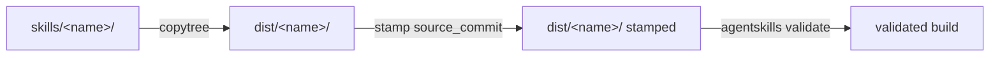

# Building a skill

Before a skill can be published it is **assembled, stamped, and validated**
into a distribution directory. This is the step the per-repo
`build_skill.py` / `build_skills.py` / `generate_docs_skill.py` scripts perform
today; the proposed [`build` module](../reference/api.md) consolidates it.

## The pipeline

1. **Assemble** — copy the skill's source tree into `dist/<name>/`, skipping
   `__pycache__`.
2. **Stamp** — write `metadata.source_commit` into the copied `SKILL.md` (the
   commit defaults to the repo's git `HEAD`). The tracked source is never
   modified.
3. **Validate** — run the agent-skills reference validator
   (`agentskills validate`) against the built directory.

Packaging the validated `dist/<name>/` into release assets (a tarball and zip)
is the [publishing workflow](publishing.md)'s job, not the build script's.

## Proposed API

!!! warning "Proposed / not yet implemented"
    The functions below are design stubs (`build.py`). Their bodies raise
    `NotImplementedError`; the signatures define the intended contract.

- **`discover_skills(skills_dir)`** — return the names of every skill directory
  (those containing a `SKILL.md`) under `skills_dir`. Repos that ship several
  skills (e.g. `soliplex-concierge`) iterate over this.
- **`git_head_commit(repo_dir)`** — the repo's current commit SHA, or `None`.
- **`build_skill(name, *, src, dist, commit=None, validate=True)`** — run the
  three steps above and return the built `dist/<name>/` path.

Stamping itself lives in [`metadata.stamp_source_commit`](../reference/api.md),
shared with the version-management client so the *write* and the *read* of
`source_commit` cannot drift apart.

!!! note "What this de-duplicates"
    `stamp_source_commit()` is currently byte-for-byte identical in
    `soliplex-template/scripts/build_skill.py` and
    `soliplex-concierge/scripts/build_skills.py`, and `discover_skills()` /
    `build_skill()` are the same shape across all three repos. Centralizing
    them here removes that copy-paste.
