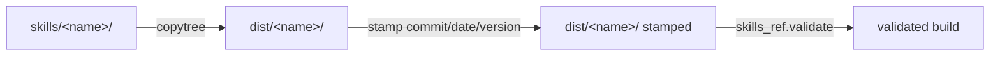

# Building a skill

Before a skill can be published it is **assembled, stamped, and validated**
into a distribution directory. Each repo's build script (`build_skill.py`, or
`build_skills.py` for the multi-skill `soliplex-concierge`) does this through
the [`build` module](../reference/api.md).

## The pipeline

1. **Assemble** — copy the skill's source tree into `dist/<name>/`, skipping
   `__pycache__`.
2. **Stamp** — write the build identity into the copied `SKILL.md`'s
   `metadata`: `source_commit` (defaulting to the repo's git `HEAD`),
   `generated` (the build date, defaulting to today), and — when supplied —
   `version` (omitted for rolling builds). The tracked source is never
   modified.
3. **Validate** — run the agent-skills reference validator
   (`skills_ref.validate()`) against the built directory.

Packaging the validated `dist/<name>/` into release assets (a tarball and zip)
is the [publishing workflow](publishing.md)'s job, not the build script's.

## API

The [`build` module](../reference/api.md):

- **`discover_skills(skills_dir)`** — return the names of every skill directory
  (those containing a `SKILL.md`) under `skills_dir`. Repos that ship several
  skills (e.g. `soliplex-concierge`) iterate over this.
- **`git_head_commit(repo_dir)`** — the repo's current commit SHA, or `None`.
- **`build_skill(name, *, src, dist, commit=None, version=None,
  generated=None, validate=True, generator=None)`** — run the three steps above
  and return the built `dist/<name>/` path. `version` / `generated` feed the
  stamp (see step 2). An optional `generator(out_dir)` runs between the stamp
  and validate steps — a hook for build-time content (e.g. the docs skill
  copies `docs/` into `references/` and appends a nav-derived map to
  `SKILL.md`).

Stamping itself lives in [`metadata.stamp_metadata`](../reference/api.md),
shared with the version-management client (which parses frontmatter through
`skills_ref`) so the *write* and the *read* of the build identity cannot drift
apart.

!!! note "One build path"
    Every repo builds through `build.build_skill`, so stamping
    (`metadata.stamp_metadata`) and validation behave identically across
    skills. `discover_skills` builds several at once (the `soliplex-concierge`
    case), and an optional `generator` hook injects build-time content (the
    `soliplex-docs` documentation map).
