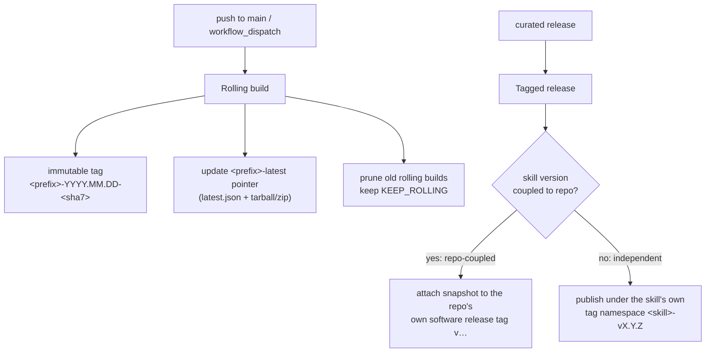

# Release model

A skill is published by a GitHub Actions workflow in its source repository.
There are two publishing modes — **rolling** and **tagged** — and the tagged
mode itself splits by how the skill is versioned.



## Rolling builds

On every change to a skill's sources (a push to `main`, or a manual
`workflow_dispatch`), the workflow:

1. Assembles, stamps, and validates the skill (see [Building](../mechanisms/building.md)).
2. Cuts an **immutable** rolling release tagged `<prefix>-YYYY.MM.DD-<sha7>`,
   marked as a prerelease, with the tarball, zip, and a `version.json` manifest
   attached.
3. Updates the stable **`<prefix>-latest` pointer** so its `latest.json` (and a
   copy of the asset) describes this newest build.
4. **Prunes** old rolling builds down to a fixed retention count
   (`KEEP_ROLLING`, currently 10) so the releases list stays tidy.

## Tagged releases

A tagged release is an explicit, curated snapshot. The **only** decision is
which tag it lands on — and that follows from how the skill is versioned:

### Repo-coupled skills → the repo's `v…` tag

When a skill's version tracks its source repository (it ships *with* the repo —
e.g. `soliplex-docs` packaging the `soliplex` repo's docs), the workflow
listens for the repo's own `release: published` event and **attaches the skill
snapshot to that `v…` release tag**. The skill rides the repo's release cadence.

### Independently-versioned skills → their own tag namespace

When a skill advances its `metadata.version` on its own cadence, decoupled from
the repo's version, its tagged release is **published under the skill's own tag
namespace** — `<skill>-vX.Y.Z` — and is **not** bundled onto the repo's `v…`
release.

!!! note "Why separate the tag namespace"
    Keeping an independently-versioned skill on its own tags means:

    - the skill's published version line is independent of the repo's release
      history; and
    - a single repository can host **several** skills, each versioned on its
      own schedule, without their releases colliding.

    The same per-skill namespacing already used for rolling tags and the
    `…-latest` pointer (the `prefix` / `rolling_re` in
    [`SkillSpec`](../reference/api.md)) extends naturally to independent tagged
    releases — a client treats *any* non-rolling tag carrying the skill's asset
    as a "release", regardless of which namespace it lives in.

## The manifest

Every published build — rolling or tagged — carries a JSON manifest with an
identical shape. For a tagged/rolling release it is attached as `version.json`;
for the `…-latest` pointer it is also published as `latest.json`.

```json
{
  "tag": "docs-2026.05.29-cc9a290f",
  "source_commit": "cc9a290",
  "generated": "2026-05-29",
  "sha256": "…64 hex chars…",
  "asset_url": "https://github.com/soliplex/soliplex/releases/download/docs-2026.05.29-cc9a290f/soliplex-docs-skill.tar.gz"
}
```

This is the single schema modeled by
[`ReleaseManifest`](../reference/api.md) (`manifest.py`) and consumed by both
the publishing workflow and every client.
